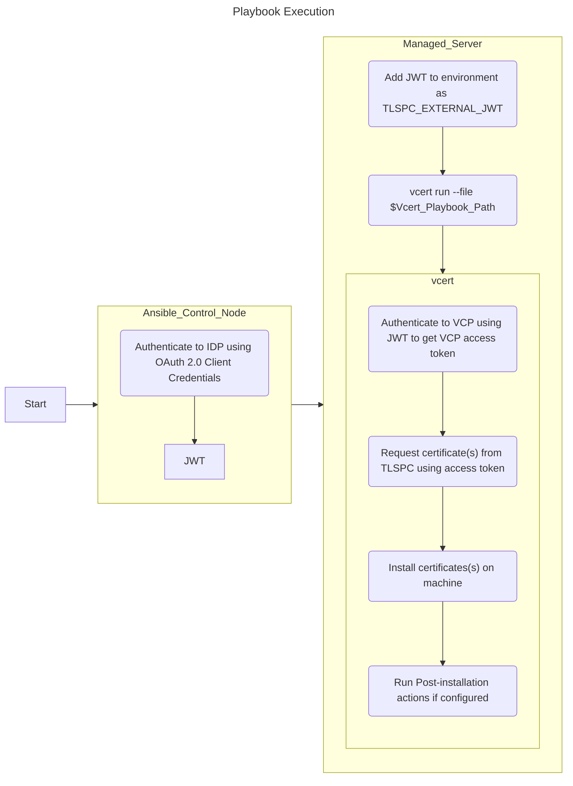

# Ansible Playbooks to Run VCert Playbooks Against the Venafi Control Plane

This folder contains sample Ansible playbooks that can be used to trigger [VCert Playbooks](https://github.com/Venafi/vcert/blob/master/README-PLAYBOOK.md) using Venafi Control Plane (VCP) [Service Accounts](https://docs.venafi.cloud/vcs-platform/serviceaccounts/about-service-accounts/). 

These ansible playbooks allow VCert playbooks to be executed without storing the credentials localy on the managed VMs. This is done by authentiating only once to your IDP on the ansible control node, and then executing a Vcert Playbook on each managed VM using the resulting temporary JSON Web Token (JWT) as the authentication credential to VCP. Ansible then injects the JWT into an environment variable that VCert will read when ansible executes the vcert playbook on the VM. Once VCert finishes running the shell session is closed, and the JWT is no longer avaliable on the VM. Additionally, this menthod allows the VM owners to control the VCert playbook if they so chose, however, it is possible for ansible to manage the VCert Playbook file if required. 

**IDP support note:** If your IDP does not have an example ansible playbook that does not mean that it is impossible to use it. It only means that an example does not exist in this repository for it. The likely reason is lack of access or time to devote to learning the IDP. Contributions of ansible playbooks for other IDPs are welcome. 

## Rquirements

Each Sample uses:
- A VCP [Custom API integration](https://docs.venafi.cloud/vcs-platform/serviceaccounts/c-about-custom-api-integration-sa/) Service Account
- A OAuth2.0 enabled application or OAuth API integration with an IDP that will return a [JSON Web Token (JWT)](https://jwt.io/)
- The OAuth 2.0 Client Credential authentication method for authenticating to the IDP Oauth2.0 endpoint.

Prior Work you must do before usingg these playbooks:
- VCert must be installed on all servers that you wish to run playbooks on.
  -** Note:** the playbooks assume VCert is installed in your PATH. If it is not, you will need to edit the playbooks to contain the full path to the VCert binary. 
- A VCP Custom API Intgration Service account already configured in TLSPC.
- An application or API integration must be configured in your IDP

Required Information - All playbooks
- The **Client ID** of your application in your IDP
- The **Client Secret** associated with your Client ID
- The **Oauth2.0 Token URL** of your IDP
- The **Path to the VCert Playbook file** that you wish to execute on your servers/inventory. This must be the complete, fully qualified, path and must be the same on all servers you wish to run it on. 
    - The [VCert Playbook](https://github.com/Venafi/vcert/blob/master/README-PLAYBOOK.md) should contain your SVC Account Token Url as the value for `tokenURL` inside of the `credentials` block in the playbook. 
- An **ansible inventory** containing the servers you wish to run Vcert Playbooks on using this VCP service account. 

## Playbook flow

